# CI/CD & Databricks Execution Graph

Complete end-to-end flow from code commit to running Databricks pipelines.

---

## Full Pipeline Execution Graph

```mermaid
flowchart TD
    %% ── Developer Actions ──────────────────────────────────────
    DEV([👨‍💻 Developer]):::person

    DEV -->|git push feature/branch| PUSH[Push to Feature Branch]
    PUSH --> PR[Open Pull Request\nto main]

    %% ── Branch Protection ──────────────────────────────────────
    PR --> PROTECT{protect_main.yml}:::workflow

    PROTECT --> PC1[pr-ready-check\nNot a Draft?]
    PROTECT --> PC2[branch-name-check\nfeature/* fix/* etc]
    PROTECT --> PC3[pr-description-check\n≥ 30 chars?]

    PC1 & PC2 & PC3 -->|All pass| MERGE_GATE{👁️ Code Review\n1 Approval Required}

    MERGE_GATE -->|Approved| MERGE[Merge PR → main]
    MERGE_GATE -->|Changes requested| DEV

    %% ── CI Pipeline ────────────────────────────────────────────
    MERGE --> CI{ci.yml\nCI Pipeline}:::workflow

    subgraph CI_JOBS["🔵 CI Jobs — Run in Parallel"]
        direction TB
        CI --> LINT[lint-and-test\nruff check\nruff format\npytest -m not ci_exclude]
        CI --> SEC[security-scan\nBandit\nSafety\nSecret scan]
        LINT --> BV[bundle-validate\ndatabricks bundle validate -t dev]
        LINT & SEC --> BUILD[build\nuv build → .whl artifact]
    end

    BV & BUILD -->|All green| CI_PASS{✅ CI Passed}
    LINT -->|Fail| CI_FAIL[❌ CI Failed\nBlock merge]
    SEC -->|Fail| CI_FAIL
    BV -->|Fail| CI_FAIL
    BUILD -->|Fail| CI_FAIL

    %% ── CD Pipeline ────────────────────────────────────────────
    CI_PASS --> CD{cd.yml\nCD Pipeline}:::workflow

    %% ── DEV Stage ──────────────────────────────────────────────
    subgraph DEV_STAGE["🟡 Stage 1 — Deploy Dev"]
        direction TB
        CD --> D1[uv build\nBuild .whl]
        D1 --> D2[databricks bundle validate -t dev]
        D2 --> D3[databricks bundle deploy -t dev\n--var git_sha --var branch\n--var finnhub_api_key --var alphavantage_api_key]
        D3 --> D4[Upload .whl to\ndbfs:/Volumes/mlops_dev/.../packages/]
        D4 --> D5[🔥 Smoke Test\ndatabricks bundle run\nfinancial_retraining_workflow -t dev --no-wait]
    end

    D5 -->|Success| ACC_GATE{main branch?}
    D5 -->|Fail| FAIL_DEV[❌ Dev Deploy Failed]

    %% ── ACC Stage ──────────────────────────────────────────────
    ACC_GATE -->|Yes| ACC_STAGE

    subgraph ACC_STAGE["🟠 Stage 2 — Deploy Acceptance"]
        direction TB
        A1[uv build]
        A2[databricks bundle deploy -t acc\n--var git_sha --var branch\n--var API keys]
        A3[Upload .whl to\ndbfs:/Volumes/mlops_acc/.../packages/]
        A4[🧪 Acceptance Test\ndatabricks bundle run\nfinancial_retraining_workflow -t acc --no-wait]
        A1 --> A2 --> A3 --> A4
    end

    A4 -->|Success| PRD_STAGE

    %% ── PRD Stage ──────────────────────────────────────────────
    subgraph PRD_STAGE["🔴 Stage 3 — Deploy Production"]
        direction TB
        P1[uv build]
        P2[databricks bundle deploy -t prd\n--var git_sha --var branch\n--var API keys]
        P3[Upload .whl to\ndbfs:/Volumes/mlops_prd/.../packages/]
        P1 --> P2 --> P3
    end

    P3 -->|Success| PRD_OK[✅ Production Deployed]
    P3 -->|Fail| ROLLBACK

    subgraph ROLLBACK["🚨 Emergency Rollback"]
        direction TB
        R1[databricks bundle deploy -t prd\n--var git_sha=previous_sha]
    end

    ROLLBACK --> PRD_FAIL[⚠️ Rolled Back to Previous SHA]

    %% ── Databricks Runtime ─────────────────────────────────────
    PRD_OK --> DB_RUNTIME

    subgraph DB_RUNTIME["☁️ Databricks Workspace — Always-On Pipelines"]
        direction TB

        subgraph INGEST["📥 Ingestion Workflow — Manual / Event"]
            direction LR
            I1[collect_finnhub_stream.py\nFinnhubCollector\nWebSocket → Buffer → Delta]
            I2[run_streaming_pipeline\nFire DLT trigger]
            I1 -->|landing zone files| I2
        end

        subgraph DLT["⚡ Streaming DLT Pipeline — financial-streaming-dlt"]
            direction LR
            B[bronze_trades\nAuto Loader\nJSON → Delta]
            S[silver_trades\nDedup + Validate\n+ Enrich]
            G[gold_trade_features\nRSI · MACD · VWAP\nBollinger · Volume Z-score]
            B -->|dlt.read_stream| S -->|dlt.read| G
        end

        subgraph RETRAIN["🏆 Retraining Workflow — Nightly 00:00 UTC"]
            direction LR
            T1[train_tournament.py\n4-Model Tournament\nLightGBM · XGBoost\nRF · IsolationForest]
            T2[deploy_anomaly_model.py\nChampion/Challenger Gate\nPROMOTE or REJECT]
            T3[(UC Model Registry\nanomaly_model_champion\nalias: champion)]
            T1 -->|challenger result| T2 -->|register + alias| T3
        end

        subgraph MONITOR["📊 Drift Monitoring — Every 30 min"]
            direction LR
            M1[detect_drift.py\nLoad reference window\nLoad current window]
            M2[DriftDetector\nPSI on numericals\nJS on categoricals]
            M3{overall_drift?}
            M4[RetrainingTrigger\nCooldown check\nDaily limit check]
            M5[AlertManager\nWebhook + Delta audit]
            M6[🔄 Trigger Retraining Job\nWorkspaceClient.jobs.run_now]
            M1 --> M2 --> M3
            M3 -->|Yes| M4 --> M5 --> M6
            M3 -->|No| MEND[✅ No action]
        end

        I2 -->|triggers| DLT
        G -->|gold_trade_features| RETRAIN
        G -->|gold_trade_features| MONITOR
        M6 -->|triggers| RETRAIN
    end

    %% ── Manual Triggers ────────────────────────────────────────
    MANUAL([👨‍💻 Manual\nworkflow_dispatch]):::person
    MANUAL -->|target: dev/acc/prd| CD

    %% ── Styles ─────────────────────────────────────────────────
    classDef workflow fill:#1a1a2e,stroke:#4a90d9,color:#fff,rx:6
    classDef person fill:#2d6a4f,stroke:#52b788,color:#fff,rx:20
    classDef default fill:#16213e,stroke:#4a4a7a,color:#e0e0e0
```



---

## Stage-by-Stage Legend

| Symbol | Stage | Runs On |
|---|---|---|
| 🔵 | CI Pipeline | GitHub-hosted Ubuntu runner |
| 🟡 | Deploy Dev | GitHub-hosted Ubuntu runner → Databricks dev |
| 🟠 | Deploy Acceptance | GitHub-hosted Ubuntu runner → Databricks acc |
| 🔴 | Deploy Production | GitHub-hosted Ubuntu runner → Databricks prd |
| 🚨 | Emergency Rollback | Auto-triggers on prd failure |
| ☁️ | Databricks Always-On | Databricks Serverless / Jobs compute |

---

## Timing Reference

| Event | Expected Duration |
|---|---|
| CI (lint + test + build) | ~3–6 minutes |
| Bundle validate | ~30 seconds |
| Deploy to dev | ~2–3 minutes |
| Deploy to acc | ~2–3 minutes |
| Deploy to prd | ~2–3 minutes |
| **Full push → production** | **~10–15 minutes** |
| Ingestion job (5 min run) | 5 minutes |
| DLT pipeline (trigger mode) | 5–15 minutes |
| Retraining nightly job | 30–90 minutes (4 models) |
| Drift monitoring (every 30 min) | 2–5 minutes |

---

## Trigger Summary

```
Developer push to feature branch
         │
         ├──► protect_main.yml  (PR checks: naming, draft, description)
         │
         └──► [PR approved] merge to main
                    │
                    ├──► ci.yml        (lint + test + bundle validate + build)
                    │         │
                    │         └──► cd.yml   (dev → acc → prd)
                    │                   │
                    │                   └──► Databricks bundle deploy
                    │                             │
                    │                             └──► Smoke test (retrain job --no-wait)
                    │
                    └──► [Always running in Databricks]
                              Ingestion     → every manual/scheduled run
                              DLT           → triggered by ingestion
                              Retraining    → nightly 00:00 UTC
                              Drift Monitor → every 30 minutes
```
