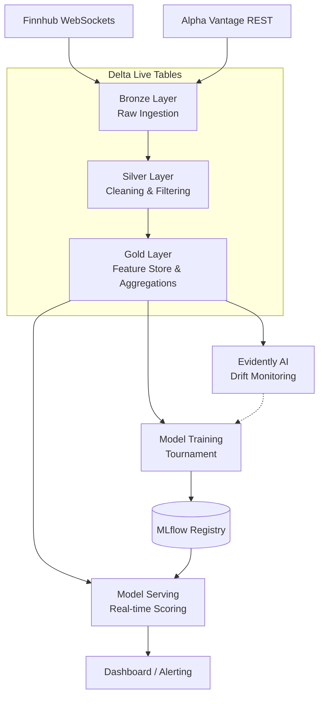

# Financial AI MLOps - Comprehensive Architecture & Runbook

This document serves as the single source of truth for the Enterprise Financial Market Anomaly Detection MLOps system. It provides a detailed architectural walkthrough, deployment guidelines, MLOps workflow documentation, and operational troubleshooting playbooks.

---

## 1. System Architecture

The project implements a real-time streaming MLOps architecture built entirely on Databricks. It identifies anomalous financial market transactions, trading behavior, and price action using streaming data and a multi-model evaluation process.

### 1.1 Data Flow & Medallion Architecture



### 1.2 Core Technologies
- **Compute & Orchestration:** Databricks Asset Bundles (DABs), Delta Live Tables (DLT), Databricks Workflows.
- **Machine Learning:** MLflow (Tracking & Registry), Scikit-Learn, LightGBM, XGBoost.
- **Data Engineering:** PySpark, Delta Lake.
- **Monitoring & Data Drift:** Custom PSI (Population Stability Index) + Jensen-Shannon Divergence (no external dependency).
- **Streaming Inputs:** Finnhub WebSocket (real-time trades), Alpha Vantage REST (historical context).
- **Branch Protection:** `protect_main.yml` enforces PR-only flow with naming convention + description checks.

---

## 2. Directory Structure

```text
.
├── dashboard/               # HTML/JS/CSS frontend for viewing anomalies
├── project_config.yml       # Centralized hyperparameters, feature lists, and thresholds
├── databricks.yml           # Databricks Asset Bundles (DABs) configurations
├── pyproject.toml           # Python dependencies (uv/pip) and build system
├── Operational_Documents/   # Runbooks, guides, reference docs (this folder)
│   ├── README.md
│   ├── RUNBOOK.md
│   ├── CICD_EXECUTION_GRAPH.md
│   ├── PROJECT_STRUCTURE.md
│   └── FUNCTION_AND_CONFIG_REFERENCE.md
├── resources/               # YAML definitions for Databricks infrastructure
│   ├── ingestion_workflow.yml  # Finnhub + DLT ingestion job
│   ├── drift_monitoring.yml    # Scheduled drift detection job
│   ├── retraining_workflow.yml # Retraining & multi-model tournament pipeline
│   └── streaming_pipeline.yml  # DLT pipeline definition
├── .github/workflows/
│   ├── ci.yml               # Lint, test, bundle validate, build
│   ├── cd.yml               # Deploy dev → acc → prd
│   ├── protect_main.yml     # Branch protection, PR naming, draft check
│   └── model_validation.yml # Manual model validation gate
├── scripts/                 # Entry-point scripts / Notebook tasks run by Databricks Jobs
│   └── financial/
│       ├── collect_finnhub_stream.py
│       ├── collect_alphavantage_history.py
│       ├── dlt_pipeline.py
│       ├── train_tournament.py
│       ├── deploy_anomaly_model.py
│       ├── detect_drift.py
│       ├── export_dashboard_metrics.py
│       └── rollback_model.py
└── src/                     # Core business logic module (financial_transactions)
    └── financial_transactions/
        ├── config.py        # All Pydantic config models
        ├── dlt/             # Bronze, Silver, Gold DLT helpers
        ├── features/        # Feature engineering + Feature Store manager
        ├── models/          # Model tournament, champion/challenger, base model
        ├── monitoring/      # PSI/JS drift detector, performance monitor, alerting
        ├── serving/         # Model serving, A/B testing, rollback manager
        └── streaming/       # Finnhub + AlphaVantage collectors, stream processor
```

---

## 3. Local Setup & Development

This project uses `uv` for lightning-fast Python dependency management and builds.

### 3.1 Environment Setup
1. **Install uv**: Follow the official guide to install `uv` (e.g., `curl -LsSf https://astral.sh/uv/install.sh | sh`).
2. **Create Virtual Environment**:
   ```bash
   uv venv
   source .venv/bin/activate  # On Windows: .venv\Scripts\activate
   ```
3. **Install Dependencies**:
   ```bash
   uv pip install -e ".[dev,test,streaming]"
   ```

### 3.2 Testing
The project uses `pytest` for unit and integration testing. Tests are located in the `tests/` directory.
```bash
# Run all tests with coverage
pytest tests/ --cov=src/financial_transactions
```

---

## 4. Deployment Guide (Databricks Asset Bundles)

All infrastructure (Pipelines, Jobs, Experiments) is declared as code using Databricks Asset Bundles (`databricks.yml`).

### 4.1 Prerequisites
- **Databricks CLI**: Must be installed and configured (`databricks configure`).
- **API Keys**: Ensure `FINNHUB_API_KEY` and `ALPHAVANTAGE_API_KEY` are available as environment variables or configured in your environment.

### 4.2 Environments
Target environments are configured in `databricks.yml`:
- `dev`: Development workspace (`mlops_dev` catalog).
- `acc`: Acceptance/Staging workspace (`mlops_acc` catalog).
- `prd`: Production workspace (`mlops_prd` catalog).

### 4.3 Deployment Commands
To build the Python wheel and deploy infrastructure to a specific target:
```bash
# Deploy to Development
databricks bundle deploy -t dev

# Deploy to Production
databricks bundle deploy -t prd
```

---

## 5. MLOps Workflow & Multi-Model Tournament

The core of this system is the autonomous retraining and evaluation engine.

### 5.1 The Tournament (`train_tournament.py`)
Triggered via `financial-retraining-workflow`, the tournament trains four different model architectures simultaneously:
1. **LightGBM**: Highly efficient gradient boosting (Default Primary).
2. **XGBoost**: Robust gradient boosting alternative.
3. **Random Forest**: Ensemble method to prevent overfitting.
4. **Isolation Forest**: Unsupervised anomaly detection.

Hyperparameters for all models are centrally managed in `project_config.yml`.

### 5.2 Champion / Challenger Gating (`deploy_anomaly_model.py`)
Models are evaluated against a holdout dataset. The system employs a rigorous gating mechanism:
- **Primary Metric**: `pr_auc` (Precision-Recall Area Under Curve).
- **Threshold**: The Challenger must improve upon the existing Champion's `pr_auc` by a minimum of `0.005` (configurable in `project_config.yml`).
- **Promotion**: If successful, the Challenger is registered in the MLflow Model Registry and alias tagged as the new `Champion`.

---

## 6. Data Drift & Monitoring

Data drift monitoring is orchestrated by `resources/drift_monitoring.yml`.

- **Job**: `financial-drift-monitoring`
- **Schedule**: Every 30 minutes (`0 */30 * * * ?`).
- **Mechanism**: `detect_drift.py` loads a reference window (last 30 days) and a current window (since yesterday) from `gold_trade_features`.
- **Metrics Evaluated**:
  - **PSI** (Population Stability Index) on numerical features — threshold `0.2`
  - **Jensen-Shannon Divergence** on categorical features — threshold `0.1`
- **Retraining Trigger**: If any feature drifts, OR model PR-AUC drops >5%, OR sufficient new records — `RetrainingTrigger` fires (subject to cooldown ≥6h and daily limit ≤4).
- **Alerting**: `AlertManager` sends webhook notification (Slack/Teams) and writes audit row to `drift_monitoring` Delta table.

---

## 7. Operational Playbooks & Troubleshooting

### Scenario A: Delta Live Tables (DLT) Pipeline Failures
- **Symptom**: `financial-streaming-dlt` job fails or stops processing records.
- **Investigation**: 
  1. Check the DLT UI in Databricks.
  2. If the failure occurs at `bronze_ingest.py`, verify that the Finnhub API rate limits haven't been exceeded or that the payload schema hasn't changed.
  3. If running in batch mode (`continuous: false`), consider changing to `true` in `resources/streaming_pipeline.yml` for uninterrupted real-time streaming.
- **Resolution**: Adjust schema evolution settings or rotate API keys if rate-limited.

### Scenario B: High Volume of False Positives
- **Symptom**: The dashboard indicates a massive spike in detected anomalies during normal market conditions.
- **Investigation**:
  1. Manually trigger the `financial-drift-monitoring` job. Review the Evidently AI drift reports.
  2. Check `project_config.yml` to see if market volatility features have heavily drifted.
- **Resolution**: If structural market drift is confirmed, manually trigger the `financial-retraining-workflow` to update the model baseline.

### Scenario C: Emergency Model Rollback
- **Symptom**: A newly deployed model exhibits severely degraded performance and is impacting downstream consumers.
- **Investigation**: Verify model performance via the dashboard and MLflow real-time metrics.
- **Resolution**: Execute the rollback script to immediately demote the current Champion and restore the previous approved version:
  ```bash
  # Can be executed via Databricks Workflows or a connected notebook
  python scripts/financial/rollback_model.py
  ```

### Scenario D: Missing Dashboard Metrics
- **Symptom**: The frontend dashboard is blank or shows stale data.
- **Investigation**:
  1. Verify the `export_dashboard_metrics.py` task is completing successfully.
  2. Ensure the Databricks Model Serving endpoint (if active) is accessible and not in a scaled-to-zero / cold-start state.

### Scenario E: Direct Push to Main — Branch Protection Triggered
- **Symptom**: `protect_main.yml` fires and the `block-direct-push` job fails. The commit is already on `main`.
- **Investigation**: Check who pushed and the commit SHA from the GitHub Actions log.
- **Resolution**:
  1. Revert the commit: `git revert <sha> && git push origin main`
  2. Apply the change correctly via a PR from a `feature/*` or `fix/*` branch.
  3. Ensure GitHub Branch Protection Rules are enabled under `Settings → Branches` to prevent recurrence.

### Scenario F: CI Skipped Unexpectedly
- **Symptom**: A push to `main` or `develop` did not trigger `ci.yml`.
- **Investigation**: Check if the commit only touched `Operational_Documents/**` or `README.md` — these paths are excluded via `paths-ignore` in `ci.yml` by design.
- **Resolution**: If CI should have run, ensure the commit includes at least one file outside the ignored paths.
